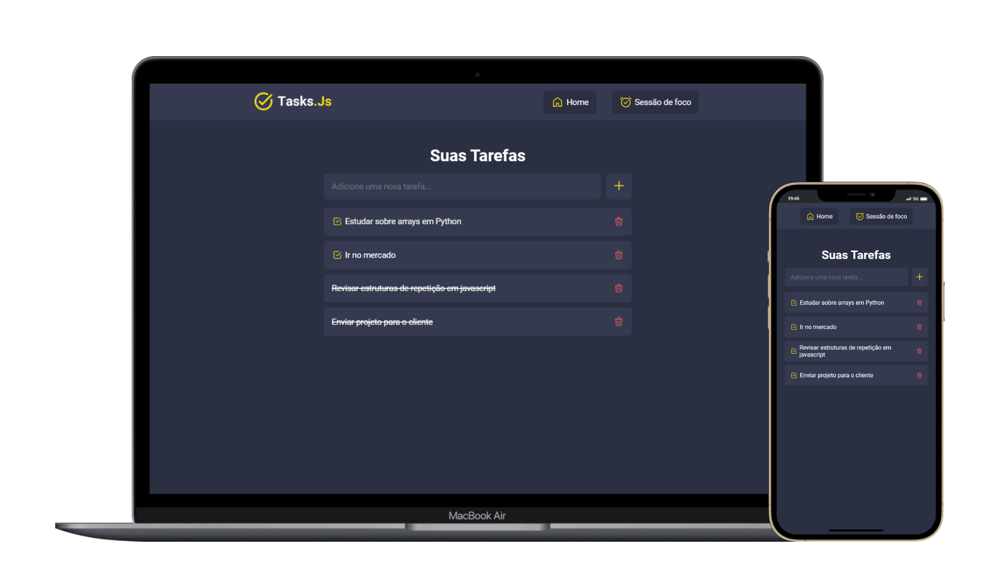
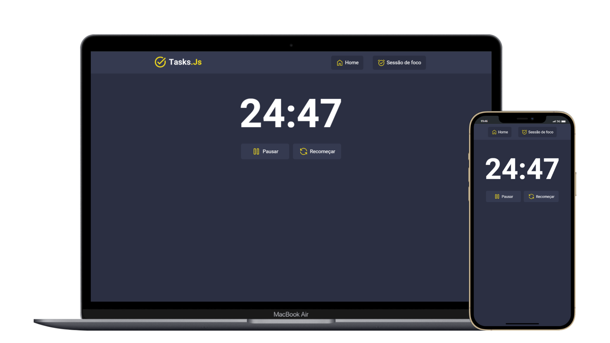

# Task.Js
Lista de tarefas com armazenamento em Local Storage e timer para aplicar a técnica Pomodoro.

## ⬆️ Atualizações
- Mudança no design do projeto
- Ao concluir a tarefa o texto fica riscado
- Página da sessão de foco separada da home.
- Timer de 25min com os controles de play e pause.
- Modal + notificação sonora para informar o usuário que o timer acabou.

## 🎨 Design
- [Canva](https://www.canva.com/)
- [TablerIcons](https://tablericons.com/)
- [Google Material Symbols](https://fonts.google.com/icons)
- [Google Fonts](https://fonts.google.com/)

## 🛠️ Stack utilizada
- HTML 
- CSS
- JAVASCRIPT