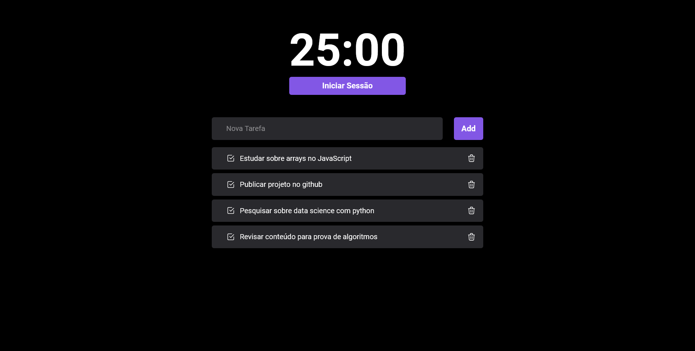
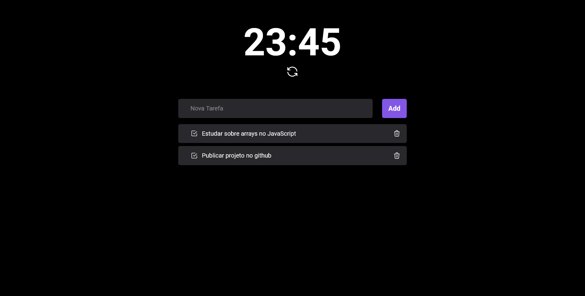

# Tasks.Js
Lista de tarefas com armazenamento em Local Storage e timer para aplicar a técnica Pomodoro.

## ⚙️ Funcionalidades
- Adicionar tarefas
- Armazenar as tarefas no Local Storage do navegador
- Concluir/Remover as tarefas criadas
- Timer de 25 minutos para aplicar a técnica Pomodoro

## 🛠️ Stack utilizada
- Html
- Css
- JavaScript

## 📚 Aprendizados
- Entender melhor sobre a DOM e organização das ideias usando a sintaxe da linguagem JavaScript.
- Reforçar os conhecimentos sobre a construção de layouts com HTML e CSS.
- Melhorar a habilidade de pesquisar sobre tópicos em caso de dúvida.

## 🔎 Fontes de Pesquisa 
- __[RocketSeat](https://www.rocketseat.com.br/)__: Concluindo a [Maratona Discover 1](https://www.youtube.com/playlist?list=PLeLKux5eT3kY2mvZUi7IM5T548vfKxGq5) aprendi muito sobre sintaxe e lógica de programação usando JavaScript e dicas cruciais sobre HTML e CSS que pude aplicar nesse projeto. Usei o [Design System](https://www.youtube.com/watch?v=90y5707fJbI) da RocketSeat como inspiração para a construção do layout do projeto.

- __[Artigo do blog Hora de Codar](https://horadecodar.com.br/2020/12/14/contador-regressivo-com-javascript-puro/)__: Aprendi sobre como construir um timer utilizando a função setInterval() no JavaScript.